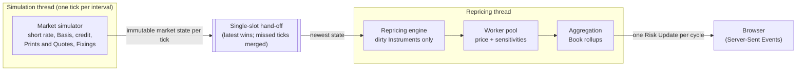

# Fixed Income Risk Engine

A working, real-time fixed income risk engine: a simulated market anchored to the real US Treasury curve,
a Book of Treasuries, Treasury futures, corporate bonds and interest rate swaps, and an engine that
reprices that Book selectively as the market moves and streams risk to a browser.

It is the running example for the article series **[Building a Fixed Income Risk Engine](https://suhasghorp.github.io/fixed-income-risk/)**:
*how real-time risk works, and a working engine to prove it.*

## What it shows

- **Prices are derived, not observed.** The curve is bootstrapped from published par yields; corporate
  bonds are priced from Marks built out of sparse, noisy trade Prints and dealer Quotes, never from the
  hidden "true" spread.
- **Risk factors are hierarchical and correlated.** Rates, futures Basis and credit (Systemic, Sector and
  Idiosyncratic Factors) move together through a correlation matrix; Credit Events jump spreads and
  downgrade issuers.
- **Real-time risk means repricing selectively.** An Instrument is repriced only when a Risk Factor it
  depends on has moved past a Materiality Threshold since it was last priced, so most of the Book is
  untouched on most ticks, and the UI shows the Staleness that saving costs.
- **Risk:** DV01, Bucketed DV01 by curve Pillar, CS01, and rollups by Instrument type and Rating Bucket,
  all by bump-and-reprice.

## Quick start

Prerequisites: Java 25, Maven 3.8+, Node.js 20+.

```bash
# Terminal 1: the engine, in the reproducible demo configuration (http://localhost:8080)
cd backend && mvn spring-boot:run -Dspring-boot.run.profiles=demo

# Terminal 2: the UI (http://localhost:5173)
cd frontend && npm install && npm run dev
```

Open http://localhost:5173.

### The demo profiles

| Profile | What it pins |
|---|---|
| `demo` | The bundled Treasury curve (2026-09-11) instead of today's live one; seed 42; 1 simulated hour per tick, 24 ticks per simulated day, one tick per second; Acme Industries downgraded on tick 120. Every run is identical. |
| `demo,demo-slow` | The demo, ticking every 200ms while each repricing cycle is slowed to 1s, so ticks are visibly coalesced while the simulation keeps its pace. |

To freeze the run at an exact state (the articles' screenshots use this), add a stop tick:

```bash
cd backend && mvn spring-boot:run -Dspring-boot.run.profiles=demo \
    -Dspring-boot.run.arguments=--risk.simulation.stop-at-tick=121
```

The simulation halts after tick 121; the UI stays on that state and shows "Stopped". Without a profile, the
engine starts from today's live Treasury curve (falling back to a cached or the bundled curve if the
Treasury site can't be reached) with a random seed, which is logged so the run can be replayed.

## Architecture



- The **simulation thread** advances the market one tick per wall-clock interval and publishes each tick
  as an immutable market state. It never prices, so market time never depends on compute load.
- The **repricing thread** takes the newest state from a single-slot hand-off. Ticks that arrived while it
  was busy are coalesced: their events (coupons, CTD Switches, Rating Migrations) are kept, but only the
  newest market is priced.
- Dirty Instruments are priced in parallel on a worker pool, then aggregated, and exactly one
  **Risk Update** per cycle is streamed to the browser over Server-Sent Events
  (`GET /api/risk/stream`). A client receives a full **Risk Snapshot** on connect and reconnects for a
  fresh one if it detects a gap in the sequence numbers.
- `RiskSession` runs the same simulation and pricing on the calling thread, one tick or one coalesced
  cycle at a time, which is how the tests drive everything deterministically.

## Key design decisions

**Selective repricing on Materiality Thresholds.** Under a one-factor rates model the whole curve moves on
every tick, so "reprice what changed" would reprice everything. Instead each Instrument is compared with
the factor values it was last priced at, and repriced only when one of them has moved past a per-factor-type
threshold (for example 2bp on a curve Pillar). Slow drift accumulates until it triggers a reprice, and the
lag, Staleness, is bounded by the thresholds and shown in the UI.

**Dependencies limited to material exposure.** Every coupon bond has a cash flow near the short end, so if
bonds depended on every Pillar their cash flows touch, the whole Book would reprice whenever the short end
moved. An Instrument depends on a Pillar only if that Pillar carries at least 5% of its Bucketed DV01.
Short-dated bonds then reprice more often than long-dated ones, as the model implies.

**Discrete Risk Factors.** The Valuation Date, a future's current Proxy Bond and an issuer's rating are
Risk Factors where any change is a move, so a Day Rollover, a CTD Switch or a Rating Migration always
reprices the Instruments that depend on it.

**Two clocks.** Ticks move the market; the Valuation Date (used for accrual, time to maturity and cash
flows) moves only at a Day Rollover every N ticks, when the whole Book is aged and coupons, redemptions and
swap payments are processed, as desks fix their valuation date intraday.

**Corporates are priced from Marks, not from the true spread.** Each issuer's spread is simulated but
hidden. The engine sees only Prints and Quotes; the Mark resets to each observation and is carried forward
between them by the observable Systemic and Sector Factors (matrix pricing). Illiquid names visibly drift
from the truth until they trade. A Rating Migration is public at once, but the spread jump behind it
reaches the Mark only through later Prints, and the UI shows "downgraded, Mark stale" meanwhile.

**Rating Migrations rewire dependencies at runtime.** A downgrade moves the issuer onto a new Sector
Factor. The Instrument's dependencies and its Rating Bucket in the rollups are recomputed from the same
market state in the same cycle, so they never disagree.

**Latest-wins coalescing, one JVM.** Queueing every tick would let risk fall ever further behind, and
slowing the simulation would tie the market to compute load; merging missed ticks keeps risk on the
newest market. Separate processes over a message bus is the production shape, but at this scale an
in-process hand-off of immutable state shows the same design with far less machinery.

**DV01 bumps the model's output curve.** Bumping a bond's yield only works for bonds, and bumping the
short rate moves long tenors less than short ones. Bumping the output zero curve gives one definition for
every curve-sensitive Instrument, and the bump can be localised to one Pillar for Bucketed DV01.

**Futures carry risk but no value.** Futures are margined daily, so a futures Position's value is zero
while its price and DV01 are real; including notional would inflate the Book's value.

**Single-curve swaps.** Swaps are discounted and projected off the same simulated Treasury curve. A real
desk discounts on OIS and projects off the index curve; one curve keeps swaps a function of the existing
market at the cost of ignoring that basis.

**Hand-written quant maths.** Curve bootstrapping, Hull-White, the simulators and every pricer are written
directly rather than taken from a quant library, because those are the parts worth reading. Correctness is
checked against reference values and analytic approximations in the tests.

## Project layout

- `backend/`: Java 25, Spring Boot.
  - `curve/`: par curve sources and bootstrapping.
  - `model/`: Hull-White, the Basis simulator, correlated shocks.
  - `credit/`: the spread hierarchy, Prints and Quotes, Marks.
  - `instrument/`: Treasuries, futures, corporates, swaps.
  - `risk/`: DV01, Bucketed DV01, CS01.
  - `repricing/`: dependencies and Materiality Thresholds.
  - `session/`: the market simulator, pricing, rollups, snapshots and updates.
  - `stream/`: the threads, the hand-off and the SSE endpoint.
- `frontend/`: React and TypeScript. `src/api/riskState.ts` is the pure function that applies Risk
  Snapshots and Risk Updates and detects sequence gaps.
- `backend/src/main/resources/`:
  - `curves/`: a real Treasury par curve snapshot.
  - `refdata/`:
    - real on-the-run Treasury CUSIPs;
    - Treasury futures specs and their Proxy Bonds;
    - fictional corporate issuers, Rating Buckets and bonds;
    - swap terms;
    - the sample Book.

## Tests

```bash
cd backend && mvn test          # quant maths, RiskSession, runtime and SSE contract tests
cd frontend && npm test         # risk stream state (Vitest)
cd frontend && npm run build    # typecheck and production build
```

## Configuration

All settings live in `backend/src/main/resources/application.properties` and can be overridden on the
command line (`--name=value`).

### Simulation and time

| Setting | Meaning | Default |
|---|---|---|
| `risk.simulation.seed` | Seed for all randomness; blank for a random seed (logged, so the run can be replayed) | blank |
| `risk.simulation.simulated-time-per-tick` | Simulated time per tick | `1h` |
| `risk.simulation.ticks-per-day` | Ticks per simulated day; a Day Rollover advances the Valuation Date by one day | `24` |
| `risk.simulation.tick-interval` | Wall-clock time between ticks | `1s` |
| `risk.simulation.stop-at-tick` | Freeze the run after this tick | unset |
| `risk.curve.source` | `treasury` (live, then cached, then bundled) or `bundled` | `treasury` |
| `risk.curve.treasury-base-url`, `risk.curve.cache-file` | Where the live curve is fetched from and cached | Treasury site; `~/.fixed-income-risk/` |
| `risk.pillars` | Curve tenors for reporting and Bucketed DV01 | `3M,1Y,2Y,3Y,5Y,7Y,10Y,20Y,30Y` |

### Market model

| Setting | Meaning | Default |
|---|---|---|
| `risk.hull-white.a`, `risk.hull-white.sigma` | Hull-White mean reversion and volatility | `0.05`, `0.01` |
| `risk.correlation.matrix` | Correlation of the short-rate, Systemic and Basis shocks (rows separated by `;`); validated at startup | `1,-0.3,0.1; -0.3,1,0; 0.1,0,1` |
| `risk.futures.basis.kappa`, `.long-run-mean`, `.eta` | Futures Basis process (price points, years) | `12`, `-0.20`, `0.5` |
| `risk.futures.ctd-switch.intensity`, `.basis-jump` | CTD Switches per contract per year, and the ± Basis jump | `24`, `0.15` |
| `risk.credit.systemic.{kappa,long-run-mean-bp,sigma-bp}` | Systemic Factor process | `0.5`, `60`, `40` |
| `risk.credit.sector.{kappa,sigma-bp}` | Sector Factor processes (long-run means in `refdata/rating-buckets.csv`) | `2`, `25` |
| `risk.credit.idiosyncratic.{kappa,sigma-bp}` | Idiosyncratic Factor processes (means, Print and Quote rates in `refdata/issuers.csv`) | `20`, `15` |
| `risk.credit.events.{intensity,jump-mean-bp,jump-decay}` | Credit Events per issuer per year, mean jump, jump decay | `3`, `60`, `0.5` |
| `risk.credit.events.{migration-probability,max-notches}` | Chance an event downgrades the issuer, and by how many grades | `0.5`, `1` |
| `risk.credit.events.{print-burst-multiplier,print-burst-decay}` | The Print burst after an event | `30`, `100` |
| `risk.credit.events.scheduled` | Forced events, e.g. `ACME@120:80:1` (80bp jump and a one-grade downgrade on tick 120) | blank |

### Repricing

| Setting | Meaning | Default |
|---|---|---|
| `risk.materiality.pillar-zero-rate-bp` | Threshold on a Pillar zero rate | `2` |
| `risk.materiality.mark-bp` | Threshold on an issuer's Mark | `1` |
| `risk.materiality.credit-index-bp` | Threshold on the Systemic and Sector Factors | `1` |
| `risk.materiality.basis-points` | Threshold on a futures Basis (price points) | `0.02` |
| `risk.repricing.min-pillar-exposure` | Smallest share of an Instrument's Bucketed DV01 at a Pillar for it to count as a dependency | `0.05` |
| `risk.repricing.worker-threads` | Threads repricing dirty Instruments in parallel | `4` |
| `risk.repricing.cycle-delay` | Artificially slow each repricing cycle, to show coalescing | `0ms` |

## License

MIT; see [LICENSE](LICENSE).
